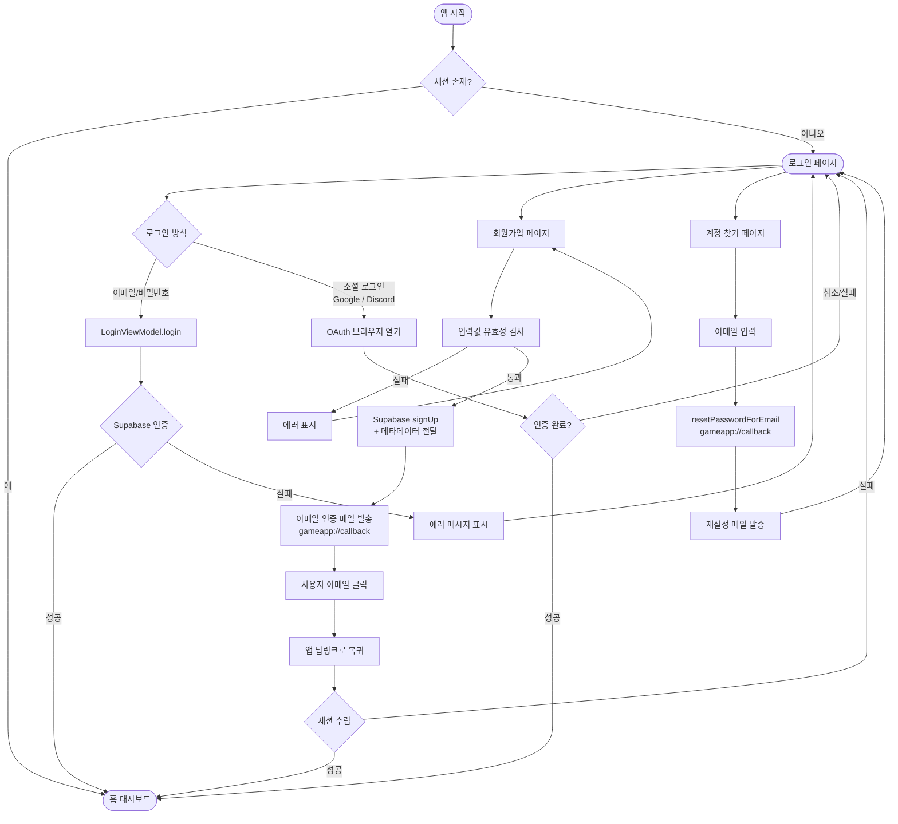

# 🎮 Cyber Neon Game Pack

사이버네틱한 디자인과 몰입감 넘치는 3D 게임 경험을 제공하는 **Flutter 기반 게임 팩 시스템**입니다. 현대적인 기술 스택과 사이버펑크 디자인 시스템을 결합하여 고퀄리티의 사용자 경험을 지향합니다.

---

## 🌟 주요 기능 (Key Features)

### 1. Cyberpunk Design System
- **미학적 설계**: Dark Background, Neon Accents, Glassmorphism 효과를 적용한 프리미엄 UI.
- **다이나믹 배경**: `Ambient Glow` 효과와 세련된 애니메이션을 통한 시각적 몰입감 극대화.
- **반응형 레이아웃**: 데스크톱 및 모바일 환경에 최적화된 인터랙티브 인터페이스.

### 2. 고성능 게임 엔진
- **3D Shooter**: `Flame` 및 `Flame 3D`를 활용한 리얼타임 3D 슈팅 게임 경험 제공.
- **Skia 기반 렌더링**: 안정적인 그래픽 성능을 위한 최적화된 렌더링 워크플로우.

### 3. 실시간 서버 연동 (Supabase)
- **인증 시스템**: 안전한 이메일/비밀번호 로그인 및 세션 관리.
- **실시간 데이터베이스**: 게임 목록, 스코어보드 등 실시간 데이터 동기화.
- **데이터 레이어**: Repository 패턴 및 DI를 통한 유연한 데이터 관리 구조.

---

## 🔐 로그인 / 인증 프로세스 (Auth Flow)




## 🛠 기술 스택 (Tech Stack)

| 구분 | 기술 / 라이브러리 | 비고 |
| :--- | :--- | :--- |
| **Framework** | Flutter 3.41.1 | Mac/Windows/Linux/Web 지원 |
| **Language** | Dart 3.11.0 | 최신 문법 및 최적화 적용 |
| **State Management** | signals_flutter | 신호를 활용한 반응형 상태 관리 |
| **Backend** | Supabase | Auth, Database, Storage 연동 |
| **Navigation** | GoRouter | 인증 기반 자동 리다이렉션 포함 |
| **Game Engine** | Flame / Flame 3D | 2D/3D 하이브리드 게임 엔진 |
| **Dependency Injection**| GetIt / Injectable | 코드 생성 기반 의존성 자동화 |
| **Design Assets** | Google Fonts | Orbitron, Space Grotesk 등 |

---

## 🚀 시작하기 (Getting Started)

### 1. 프로젝트 복제 및 라이브러리 설치
```bash
git clone https://github.com/cys940/flutter_games.git
cd flutter_games
flutter pub get
```

### 2. 환경 변수 설정 (.env)
1. 프로젝트 루트에 `.env` 파일을 생성합니다.
2. `.env.example` 파일을 참고하여 Supabase URL 및 Anon Key를 입력합니다.
```env
SUPABASE_URL=YOUR_SUPABASE_PROJECT_URL
SUPABASE_ANON_KEY=YOUR_SUPABASE_ANON_KEY
```

### 3. 코드 생성 (Optional)
의존성 주입이나 엔티티 모델 변경 시 아래 명령어를 실행합니다.
```bash
dart run build_runner build --delete-conflicting-outputs
```

---

## 📂 프로젝트 구조 (Project Structure)
- `lib/core`: 디자인 시스템, DI 설정, 라우터 등 공통 모듈
- `lib/features/auth`: 로그인 UI 및 인증 로직
- `lib/features/home`: 게임 대시보드 및 홈 화면
- `lib/features/shooter`: 3D 슈팅 게임 엔진 및 뷰모델

---

## 📜 라이선스
본 프로젝트는 교육 및 개인 학습용으로 제작되었습니다.
