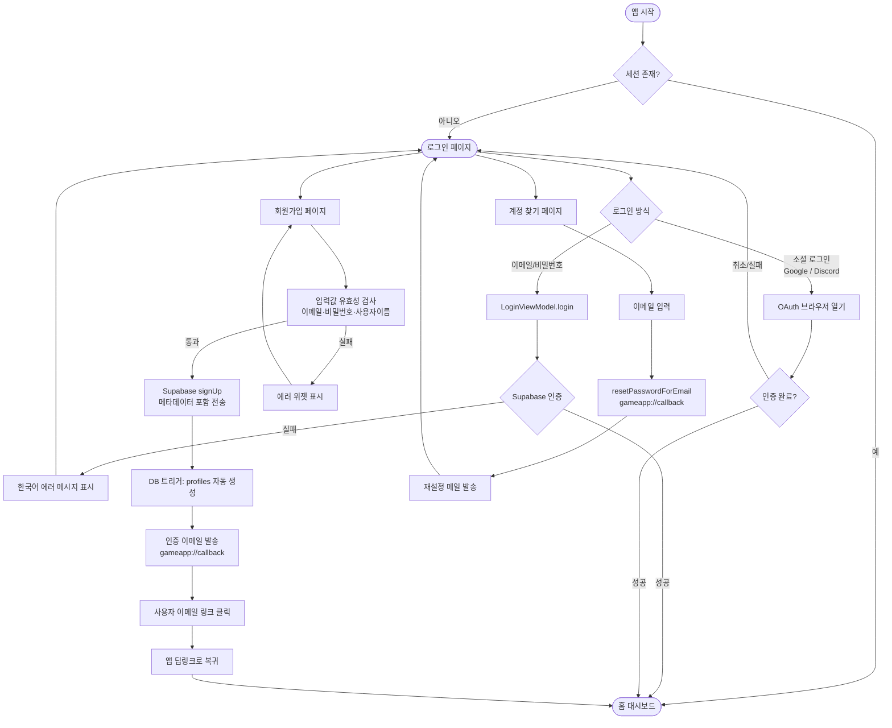

# 🎮 Cyber Neon Game Pack

사이버네틱한 디자인과 몰입감 넘치는 게임 경험을 제공하는 **Flutter 기반 멀티플랫폼 게임 팩 시스템**입니다.  
Clean Architecture와 Supabase 백엔드를 기반으로 프리미엄 사용자 경험을 지향합니다.

---

## 🌟 주요 기능 (Key Features)

### 1. 🎨 Cyber Core 디자인 시스템
- **Glassmorphism UI**: 반투명 패널, 네온 글로우, Ambient Glow 효과 적용
- **프리미엄 타이포그래피**: Orbitron, Exo 2 (Google Fonts) 기반 미래적 디자인
- **반응형 레이아웃**: `ResponsiveLayout`으로 모바일 → 태블릿 → 데스크톱 자동 최적화
- **재사용 위젯**: `GlassPanel`, `NeonButton`, `GameGauge` 등 공통 컴포넌트 라이브러리

### 2. 🔐 통합 인증 시스템 (Auth)
- **이메일/비밀번호 로그인**: Supabase Auth 기반 세션 관리
- **회원가입**: `username`, `full_name` 메타데이터 포함, DB 트리거로 `profiles` 자동 생성
- **소셜 로그인**: Google, Discord OAuth 브라우저 연동
- **이메일 인증 딥링크**: `gameapp://callback` 스킴으로 앱 복귀 처리
- **비밀번호 재설정**: 재설정 이메일 발송 → 딥링크 복귀 플로우
- **에러 핸들링**: AuthException 세분화 처리 및 한국어 에러 UI 표시

### 3. 🕹️ 게임 엔진 (Multi-Platform)
- **3D Shooter**: `Flame 3D` 기반 네이티브 3D 슈팅 게임 (데스크톱/모바일)
- **2D Shooter (Web)**: Canvas 기반 경량 2D 슈팅 (웹 환경 자동 전환)
- **Puzzle Game**: 퍼즐 게임 엔진 (`puzzle_game_engine.dart`)
- **플랫폼 자동 감지**: `ShooterEngineFactory`로 런타임에 최적 엔진 선택

### 4. 🏠 홈 대시보드
- **게임 목록 카드**: Supabase에서 게임 데이터를 실시간으로 불러와 `GameCard` 위젯으로 표시
- **게임 상세 페이지**: 게임 선택 시 상세 정보 및 실행 진입
- **실시간 스코어보드**: Supabase Realtime 기반 점수 동기화

---

## 🛠 기술 스택 (Tech Stack)

| 구분 | 기술 / 라이브러리 | 비고 |
| :--- | :--- | :--- |
| **Framework** | Flutter 3.x | macOS / Windows / Web / Android / iOS |
| **Language** | Dart 3.11+ | Null-safety, Records, Patterns |
| **State Management** | `signals_flutter` ^6.3.0 | 세분화된 반응형 시그널 |
| **Navigation** | `go_router` ^17.1.0 | Auth Guard, 딥링크 지원 |
| **Backend** | Supabase | Auth, Postgres, Realtime, Storage |
| **Game Engine** | `flame` ^1.35.1 + `flame_3d` | 2D/3D 하이브리드 |
| **DI** | `get_it` + `injectable` | 코드 생성 기반 자동화 |
| **Design** | `google_fonts` ^8.0.2 | Orbitron, Exo 2 |
| **Env** | `flutter_dotenv` | `.env` 파일 기반 설정 |
| **Social Auth** | `google_sign_in` ^7.2.0 | Google 네이티브 인증 |

---

## 🔐 로그인 / 인증 프로세스 (Auth Flow)



---

## � 프로젝트 구조 (Project Structure)

```
lib/
├── core/                          # 공통 인프라
│   ├── design_system/
│   │   └── styles.dart            # AppColors, AppTypography (Cyber Core 디자인 토큰)
│   ├── di/                        # Dependency Injection (GetIt + Injectable)
│   │   ├── injection.dart
│   │   ├── injection.config.dart  # 자동 생성
│   │   ├── supabase_module.dart
│   │   └── engine_module.dart
│   ├── engine/                    # 게임 엔진 추상화
│   │   ├── base_game_engine.dart
│   │   └── native_base_engine_3d.dart
│   ├── error/
│   │   └── app_exception.dart     # 공통 예외 처리
│   ├── layouts/
│   │   └── responsive_layout.dart # 반응형 레이아웃 위젯
│   ├── presentation/widgets/      # 공통 UI 컴포넌트
│   │   ├── glass_panel.dart
│   │   ├── neon_button.dart
│   │   └── game_gauge.dart
│   ├── router/
│   │   └── app_router.dart        # GoRouter + Auth Guard
│   └── usecases/
│       └── usecase.dart           # UseCase 추상 클래스
│
├── features/
│   ├── auth/                      # 인증 피처
│   │   ├── data/
│   │   │   └── repositories/
│   │   │       └── supabase_auth_repository.dart
│   │   ├── domain/
│   │   │   └── repositories/
│   │   │       └── auth_repository.dart
│   │   └── presentation/
│   │       ├── pages/
│   │       │   ├── login_page.dart       # 로그인 (Cyber Core 디자인)
│   │       │   ├── signup_page.dart      # 회원가입
│   │       │   └── find_account_page.dart # 비밀번호 찾기
│   │       └── viewmodels/
│   │           └── login_view_model.dart  # 인증 상태 및 액션 관리
│   │
│   ├── home/                      # 게임 대시보드
│   │   ├── data/
│   │   │   ├── models/game_model.dart
│   │   │   └── repositories/supabase_home_repository.dart
│   │   ├── domain/
│   │   │   ├── entities/game_entity.dart
│   │   │   ├── repositories/home_repository.dart
│   │   │   └── usecases/get_games_usecase.dart
│   │   └── presentation/
│   │       ├── pages/
│   │       │   ├── home_page.dart         # 게임 목록 대시보드
│   │       │   └── game_detail_page.dart  # 게임 상세 페이지
│   │       ├── widgets/game_card.dart
│   │       ├── viewmodels/home_view_model.dart
│   │       └── game/
│   │           ├── home_game_engine.dart  # 배경 애니메이션 엔진
│   │           └── score_box_component.dart
│   │
│   ├── shooter/                   # 슈팅 게임 피처
│   │   ├── domain/engine/shooter_engine.dart
│   │   └── presentation/
│   │       ├── pages/shooter_page.dart
│   │       ├── viewmodels/shooter_view_model.dart
│   │       └── game/
│   │           ├── shooter_game_widget.dart
│   │           ├── shooter_engine_factory.dart  # 플랫폼 감지 팩토리
│   │           ├── native/                      # 3D 엔진 (네이티브)
│   │           │   ├── shooter_game_engine_3d.dart
│   │           │   ├── player_3d.dart
│   │           │   ├── enemy_3d.dart
│   │           │   └── bullet_3d.dart
│   │           └── web/                         # 2D 엔진 (Web)
│   │               └── shooter_game_engine_2d.dart
│   │
│   └── games/puzzle/              # 퍼즐 게임 피처
│       ├── domain/entities/puzzle_game_engine.dart
│       └── presentation/screens/puzzle_game_screen.dart
│
└── main.dart                      # 앱 진입점 (Supabase 초기화, DI 설정)
```

---

## 🗄️ 데이터베이스 스키마 (Supabase)

### `profiles` 테이블
| 컬럼 | 타입 | 설명 |
| :--- | :--- | :--- |
| `id` | `uuid` | auth.users.id 참조 (PK) |
| `username` | `text` | 사용자 고유 이름 |
| `full_name` | `text` | 실명 |
| `avatar_url` | `text` | 프로필 이미지 URL |
| `created_at` | `timestamptz` | 가입 일시 |

> **자동 동기화**: 회원가입 시 `handle_new_user` DB 트리거가 자동으로 `profiles` 레코드를 생성합니다.

---

## 🚀 시작하기 (Getting Started)

### 1. 프로젝트 복제 및 패키지 설치
```bash
git clone https://github.com/cys940/flutter_games.git
cd flutter_games
flutter pub get
```

### 2. 환경 변수 설정 (`.env`)
```env
SUPABASE_URL=YOUR_SUPABASE_PROJECT_URL
SUPABASE_ANON_KEY=YOUR_SUPABASE_ANON_KEY
```

### 3. 코드 생성 (DI)
```bash
dart run build_runner build --delete-conflicting-outputs
```

### 4. 실행
```bash
# macOS
flutter run -d macos

# 웹
flutter run -d chrome

# Windows
flutter run -d windows
```

---

## ⚙️ Supabase 설정 (필수)

1. **Authentication → URL Configuration**
   - Site URL: `gameapp://callback`
   - Redirect URLs: `gameapp://callback` 추가

2. **Authentication → Providers**
   - Email: ✅ 활성화
   - Google: 클라이언트 ID/Secret 입력 후 활성화
   - Discord: 클라이언트 ID/Secret 입력 후 활성화

3. **Database → Migrations**
   - `supabase/migrations/20260302_create_profiles.sql` 실행

---

## 📜 라이선스
본 프로젝트는 교육 및 개인 학습용으로 제작되었습니다.
